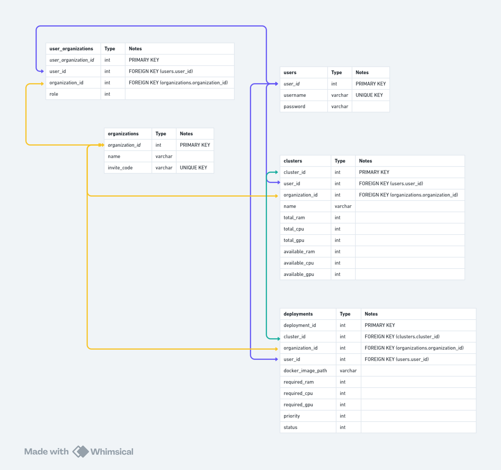

# Clusterflow

## Hypervisor-like Service for MLOps Platform

## Techstack used
- FastAPI
- SQLite
- Redis
- SQLAlchemy
- Docker


## Prerequisites

- Python 3.12+
- pip
- virtualenv
- docker


## Initial Setup

1. Run Redis as docker container
```
docker-compose up -f docker-compose.yml
```


2. Virtual Environment Setup
    - Create a virtual environment:
    ```
    cd backend
    virtualenv venv
    ```

    - Activate the virtual environment:
        - On Windows:
            ```
            .\venv\Scripts\activate
            ```
        - On macOS and Linux:
            ```
            source venv/bin/activate
            ```

    - Install dependencies:
    ```
    pip install -r requirements.txt
    ```


### Running the Development Server

Start the FastAPI server:
```
cd backend
python main.py
```

The server will be available at `http://localhost:8081/`

### API Documentation

Access the Swagger UI documentation at `http://localhost:8081/docs`


## Database Diagram

