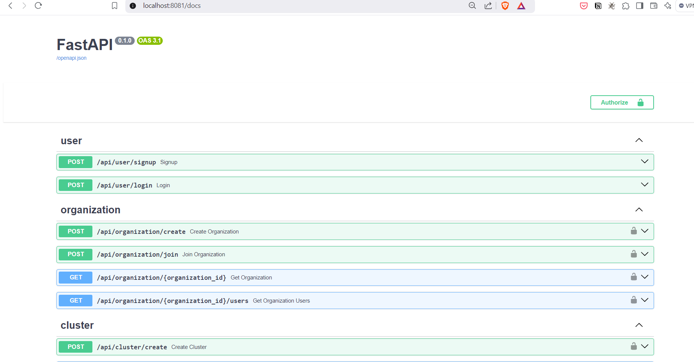

# Clusterflow

## Hypervisor-like Service for MLOps Platform

## Techstack used
- FastAPI
- SQLite
- Redis
- SQLAlchemy
- Docker


## Prerequisites

- Python 3.10+
- pip
- virtualenv
- docker


## Running the backend service
```
docker compose  -f docker-compose.yml up --build
```


The server will be available at `http://localhost:8081/`

### API Documentation

Access the Swagger UI documentation at `http://localhost:8081/docs`


## Postman v2.1 collection file
`ClusterFlow_postman_2_1.postman_collection.json`


## Database Diagram

